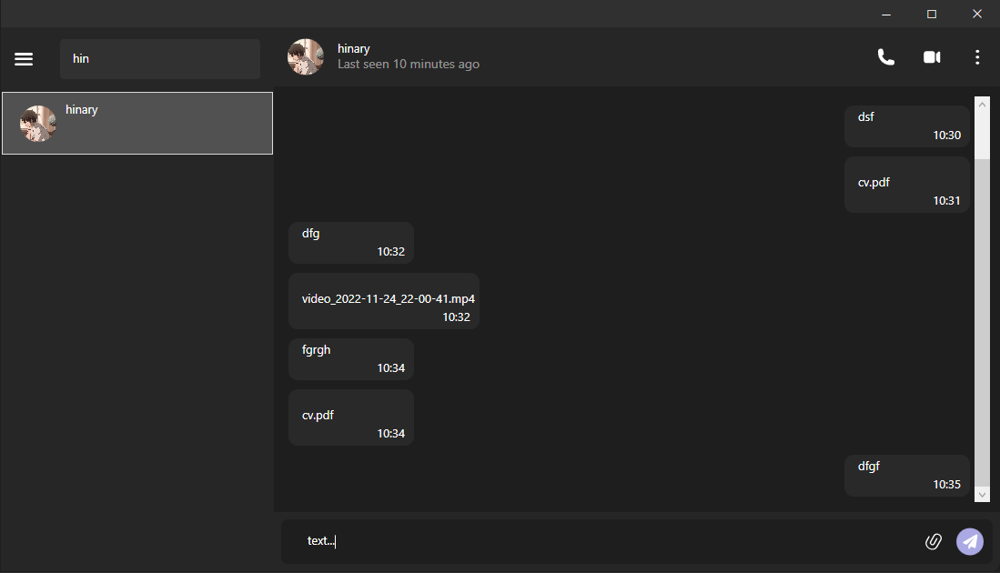

# MessengerService


## Introduction
Small service (Chat) with Web Api.Net Core server and WPF .Net Core client using many technologies and features.
This service consists of layers that provide the ability to scale the application, any logic and features. 
Provides a nice and clear interface on the client for the user.
In addition, it is possible to integrate API.

## Overview


## Technologies, Patterns were used in this project
* [Minimal API](https://docs.microsoft.com/en-us/aspnet/core/introduction-to-aspnet-core)
* [Entity Framework Core 8](https://docs.microsoft.com/en-us/ef/core/)
* [MediatR](https://github.com/jbogard/MediatR)
* [FluentValidation](https://fluentvalidation.net/)
* [Dependency injection](https://www.dotnettricks.com/learn/designpatterns/solid-design-principles-explained-using-csharp)
* [Clean Architecture](https://github.com/jasontaylordev/CleanArchitecture)
* [CQRS](https://learn.microsoft.com/en-us/azure/architecture/patterns/cqrs)
* [SOLID](https://www.dotnettricks.com/learn/designpatterns/solid-design-principles-explained-using-csharp)
  
## Requirement
These requirements must be met before you begin:
Before you start, if your .Net version < 7, install it by following this link [.Net 7.0](https://dotnet.microsoft.com/en-us/download/dotnet/7.0)

## Getting Started
```
test
```

```
test
```

## Database


