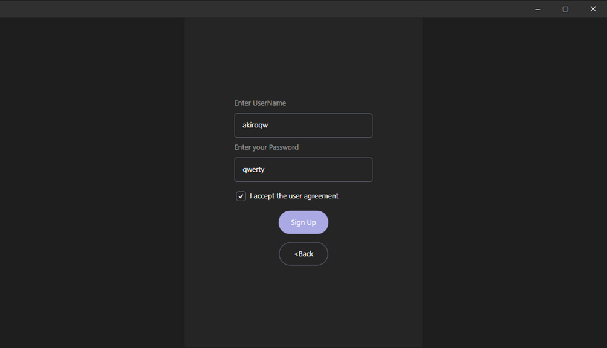

# MessengerService


## Introduction
Small service (Chat) with Web Api.Net Core server and WPF .Net Core client using many technologies and features.
This service consists of layers that provide the ability to scale the application, any logic and features. 
Provides a nice and clear interface on the client for the user.
In addition, it is possible to integrate API.

## Overview



## Technologies were used in this project

* [Python] (https://www.python.org): a simple syntactic programming language;
* [SQLite] (https://sqlite.org/index.html): SQLite is a software library that provides a relational database management system. It is a serverless, self-contained SQL database engine with zero configuration and transactions. SQLite is widely used in various applications due to its compact size, low maintenance costs and ease of use;
* [Discord Developer Portal] (https://discord.com/developers/applications): website for registering your application;
* [Discord.py ] (https://discord py.readthedocs.io/en/latest): library for integration with discord;

## Requirement
* To have Python version 3.11.3 installed (during development we started with version 3.11.3, so we cannot guarantee that earlier versions will work);

## Installation
* Сreate a bot and take a token, along with the client's ID (https://discord.com/developers/applications)
* Clone repository
```
$ git clone https://github.com/akiroqw/DiscordBot.git
```
* Open a project in VS Code
* Open the terminal and install the necessary libraries using: 
```
pip install -r requirements.txt
```

## Usage
* Create a new file .env in the src folder where the token, client id will be located
```py
TOKEN = "" Bot Token
NAME = "" Bot Name
ID = "" Client ID(App)
PREFIX = "!" Prefix (To call the command)
```
* or we can change the config file and enter this data here:
```py
setting = {
    'TOKEN' : "",
    'NAME BOT' : "",
    'ID'       : "",
    'PREFIX'   : ""
}
```
## Bot system

The bot system is implemented using 2 types, experience and levels, experience is accrued weekly, or for chatting. The bot also has a system of economy, shop, jackets, salaries and profiles

## Bot events
```py
bot.bot_ready_event() // Event triggered when the bot starts.
bot.member_join_event() // Event triggered when a new user joins the server.
bot.commands_error_event() // Event triggered when an error occurs in a command.
bot.on_message_event() // Event triggered when a message is received on the server.
```
## Various configs

To specify which roles will be served when using the `bot.collect_event(collecting_roles, 0, 0):` method, you need to specify the name of the role here, and the amount how much users will receive from this role.

```py
collecting_roles = {"Administrator" : 250000,
                    "Moderator" : 12323,
                    "G. Administrator": 123
}
```
To specify which words will be output when displaying the work message when we use the command `not.work_event(70000, 100000, text_work, 0, 0):`, we need to replace the following elements:

```py
text_work = {1: 'None', //1st option, other...
             2: 'None2', 
             3: 'None3'}
}

```

Description of the methods themselves: 
`bot.collect_event(collecting_roles, 0, 0):` - 1 argument takes the mapping, 2 and 3 are the time interval
`not.work_event(70000, 100000, text_work, 0, 0):`- 1 and 2 arguments take int values, this is the range of random salary for work. 3 argument accepts mappings for phrases, 4-5 time range

## Connecting the Database
```py
connection = sqlite3.connect('src\data\server.db') //path to the uploaded database file
cursor = connection.cursor()
```

A command is an instruction given to the bot to perform a certain function or action. The prefix for a command in this bot is '{setting['PREFIX']}'.
```py
client = commands.Bot(command_prefix = setting['PREFIX'], intents = discord.Intents.all())
client.remove_command('help')
```
To use a command, enter a prefix followed by the name of the command. For example, to use the "info" command, type "{setup['PREFIX']}info" in the chat. However, it is also possible to create custom commands. To add a custom command, define the function that performs the desired action and use the decorator '@client.command()' over it. For example, to create a command that sends a welcome message, you can define a function as follows:

```py
@client.command()
async def greet(ctx):
    await ctx.send('Hello there!')
```
You can expand the functionality of the bot, add or remove new functions. But, you need to be careful. Some functions depend on others:)

Overall, an economic bot is a great way to add an extra level of engagement to your server. This is a fun way for participants to interact with each other and fosters a sense of community. If you are looking for a way to increase the engagement of your Discord server, then the Akira economic bot is definitely worth considering!!!

